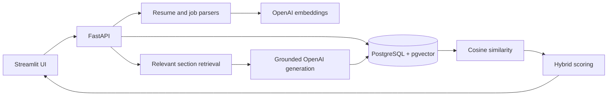

# ApplyPilot

ApplyPilot compares a resume with a role using pgvector semantic similarity and explicit,
explainable coverage signals, then optionally generates drafts grounded in resume evidence.

## Demo

There is no hosted demo. The FastAPI, PostgreSQL/pgvector and Streamlit stack runs locally
with Docker Compose.

## Problem

Keyword-only resume tools miss related language, while opaque “ATS scores” imply accuracy
they cannot demonstrate. ApplyPilot names its result a **Resume-to-Role Match**, exposes
each weighted component, and separates deterministic scoring from optional generation.

## Architecture



## Key engineering features

- FastAPI owns parsing, embeddings, scoring, persistence and generation; Streamlit is a client
- 1,536-dimension vectors match the configured `text-embedding-3-small` model
- pgvector's cosine-distance operator calculates semantic similarity inside PostgreSQL
- One stored embedding per resume or job avoids repeated embedding storage
- Hybrid score exposes semantic (50%), skills (25%), keywords (15%) and experience (10%)
- Section retrieval grounds cover letters, recruiter messages and gap explanations
- Provider failures become safe API errors; external calls have a timeout and one retry
- Integration tests use real PostgreSQL/pgvector and mocked OpenAI calls

The weights are product choices, not a measured hiring or ATS-accuracy claim.

## Tech stack

Python 3.11, FastAPI, Pydantic, SQLAlchemy 2, Alembic, PostgreSQL 16, pgvector,
OpenAI embeddings/responses APIs, Streamlit, Docker Compose, pytest, Ruff and GitHub Actions.

## Repository structure

```text
backend/             API, models and modular parsing/matching/AI services
migrations/          versioned PostgreSQL/pgvector schema
tests/               unit and PostgreSQL integration tests
app.py               thin Streamlit API client
docker-compose.yml   local database, API, UI and test services
```

## Local setup

1. Copy `.env.example` to `.env`.
2. Add your own `OPENAI_API_KEY` to `.env`.
3. Start the stack:

```sh
docker compose up -d --build --wait
```

Open Streamlit at `http://localhost:8501` and FastAPI documentation at
`http://localhost:8010/docs`. PostgreSQL is published to loopback on port `5434`.

No resume is bundled with the repository. Upload your own `.pdf` or `.txt` file locally;
the application persists extracted text and its embedding, not the source file bytes.

## Environment variables

`.env.example` documents the database URL, OpenAI key, model names, fixed embedding
dimension, CORS origin and UI-to-API URL. Never commit a populated `.env` file.

## Testing

Tests never call OpenAI or require API credits:

```sh
docker compose up -d postgres --wait
docker compose --profile test build tests
docker compose --profile test run --rm tests alembic upgrade head
docker compose --profile test run --rm tests alembic check
docker compose --profile test run --rm tests python -m ruff format --check .
docker compose --profile test run --rm tests python -m ruff check .
docker compose --profile test run --rm tests
```

The suite covers malformed/empty PDFs, unusual section formatting, boundary-aware skill
extraction, embedding failures, score weights, section retrieval, prompt grounding and a
complete resume → job → pgvector analysis → generation API flow.

## Architecture decisions

- **FastAPI** creates a reusable business boundary instead of hiding logic in UI callbacks.
- **PostgreSQL + pgvector** keep metadata, analysis results and vector comparison in one
  transactional system; a separate vector database is unnecessary at this scale.
- **Hybrid scoring** combines semantic relatedness with evidence a user can inspect.
- **OpenAI** is used for embeddings and language generation, not deterministic arithmetic.
- **Streamlit** remains a lightweight local interface while API behavior stays testable.

## Current status

Implemented: parsing, structured sections, OpenAI provider clients, pgvector persistence
and similarity, explainable hybrid scoring, grounded generation endpoints, analysis history,
Docker development, Alembic migrations and CI tests.

Verified without external credentials: migrations, pgvector queries, API flow, provider
failure handling, API/UI health checks and all tests. A live OpenAI call was not run because
no user API key was available; the repository does not claim otherwise.

There is no accuracy, user-count or production claim.

## Future work

Authentication and tenant isolation come first, followed by deletion/export controls,
encrypted hosted storage, evaluation on a consented reference set and deployment.

## Security and privacy boundary

Uploads are extension-, signature- and size-checked, and filenames are sanitized. CORS is
explicit. Provider errors do not expose prompts or credentials. Parsed resume text is
sensitive personal data; the local demo has no authentication and must not be exposed to
the public Internet. Production use would require access controls, retention/deletion
policies and encryption.
